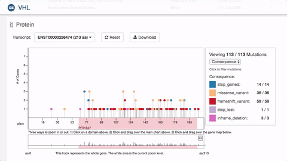

Protein Lolliplot :lollipop: :bar_chart:
=====================



Visualization to view relationship between common mutations and their location on a gene.

### Install

```
yarn
```

## Develop

```
npm start
```

Then go to http://localhost:8080/

# API

```
type TProteinLolliplotArgs = {
  onMutationClick: Function,
  onMutationMouseover: ?Function,
  onMutationMouseout: ?Function,
  onProteinMouseover: ?Function,
  onProteinMouseout: ?Function,
  data: Object,
  selector: string,
  element: Object,
  height: number,
  width: number,
  domainWidth: number,
  hideStats: bool,
  selectedMutationClass: string,
  mutationId: string,
  yAxisOffset: number,
  xAxisOffset: number,
}
```

`element`: the element which the viz will attach to. takes precedence over `selector`

`selector`: the selector of the element to attach the chart to

`data`: an object containing an array of proteins and an array of mutations (TODO: add shape)

`domainWidth`: The amino acid length of the transcript

`onMutationClick (optional)`: callback that receives the data of the clicked mutation

`width (optional)`: width of the chart

`height (optional)`: height of the chart

`hideStats (optional)`: if `true`, do not display the summary box next of the chart

`selectedMutationClass (optional)`: sets the default filter on the mutation class (Consequence, Impact, etc)
